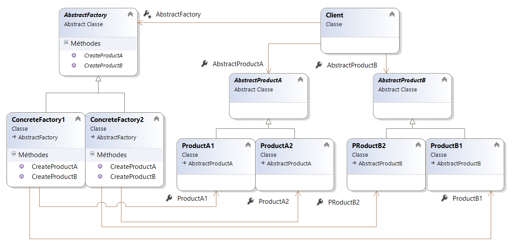
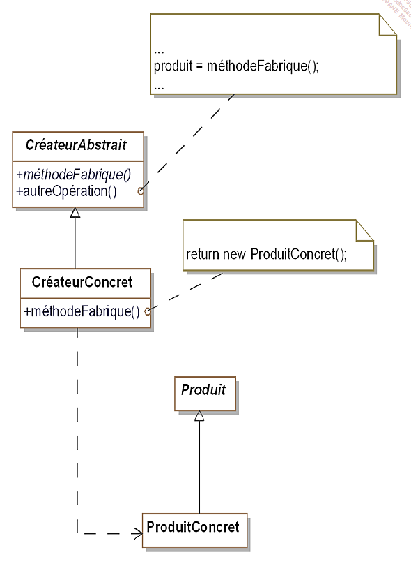
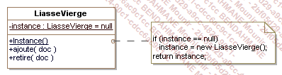

# patternDesignC-

#Initialisation repo

Abstract Factory

Abstract Factory est un pattern qui aide à la création d'objet, le but est de regrouper les objets en famille sans avoir à connaitre les bases de ces objets.

Abstract Factory va permettre de déresponsabiliser la classe mère. Pour cela, nous utilisons une interface qui va contenir des signatures de méthodes.

« L’abstract Factory » est un pattern de création (Creational Pattern) : il va donc nous servir pour instancier des objets.

Pour retenir facilement ce Patron de conception, on va essayer de comprendre ses termes : Factory et Abstract :

Factory : En développement orienté objet, une Factory (Fabrique) est un bout de code dédié qui a pour fonction de construire des objets : d’où son nom « Fabrique ».

Abstract : l’abstraction en développement objet permet de regrouper des comportements communs à une famille d’objets. Par exemple, un carré, un rectangle et un triangle vont hériter d’une classe « abstraite » « Forme Géométrique » qui contient un nombre de cotés, une superficie, etc.

Le pattern abstract Factory permet de rassembler des méthodes communes à des familles d’objets différents dans une classe commune : la fabrique abstraite, afin d’éviter au client d’appeler des méthodes différentes (concrètes) par famille d’objets.

Pour implémenter ce pattern, on fait intervenir en règle générale :

L’Abstract Factory : contient les interfaces pour les opérations communes de construction d’objets,
La Concrete Factory : contient l’implémentation concrète de construction d’un objet donné,
Les Abstract Products : déclarent les interfaces des produits,
Les concrete Products : déclarent les produits à implémenter,
Un client : le client utilisera uniquement les interfaces de l’abstract Factory pour implémenter les objets concrets.
abstractFActory

Architecture de l'application

Ici FabriqueVehicule est une interface qui contient deux signatures de méthodes créeAutomobile() et créeScooter().

La classe Scooter est une classe mère d'héritage, les classes filles ScooterElectricité et ScooterEssence utilisent extends Scooter pour étendre cette classe.

Architecture de l'application

Dans le second schéma, version générique du pattern, les structures sont affichées de façon plus générique FabriqueConcrète1 et FabriqueConcrète2 correspondraient à FabriqueVéhiculeElectricité et FabriqueVehiculeEssence.

ProduitAbstraitA correspond à scooter et ProduitAbstraitB à Automobile.

Pattern Builder
Création d'objets complexes sans avoir à s'occuper des problèmes d'implémentations

Ce pattern est utilisé pour séparer l'implémentation d'un cas spécifique de la logique/ du client.

ConstructeurAbstrait

ConstructeurLiasseVéhiculec# et ConstructeurLiasseVehiculec correspondent à ConstructeurConcret

Factory method
Généraliser la construction Builder pour préparer la création d'objet

Version générique vue en cours

Version concrète vue en cours
il s'agit d un modèle de création qui utilise des méthodes d'usine pour traiter le problème de la création d'objets sans avoir à spécifier la classe exacte de l'objet qui sera créé. Cela se fait en créant des objets en appelant une méthode de fabrique - soit spécifiée dans une interface et implémentée par des classes enfants, soit implémentée dans une classe de base et éventuellement remplacée par des classes dérivées - plutôt qu'en appelant un constructeur .

Singleton

// Le pattern singleton est uttilisé pour créer une instance unique d'une classe
//Pattern Abstract est susceptible d'uttiliser ce type d'instance unique 
//Notre application va uttiliser la classe liasse vierge(liasseVierge) qui ne possédera qu'une seule instance
//Chaque classe doit avoir accés a la meme instance et on ne peut pas en crée une nouvelle
// 

En génie logiciel, le singleton est un patron de conception (design pattern), appartenant à la catégorie des patrons de création, dont l'objectif est de restreindre l'instanciation d'une classe à un seul objet. On fournira alors un accès global à celui-ci. Il s'agit d'un des patrons de création les plus simples mais les plus couramment utilisés. 1

Il est utilisé lorsqu'on a besoin d'exactement un objet pour coordonner des opérations dans un système. Le modèle est parfois utilisé pour son efficacité, lorsque le système est plus rapide ou occupe moins de mémoire avec un seul objet qu'avec beaucoup d'objets similaires.

using System;

namespace RefactoringGuru.DesignPatterns.Singleton.Conceptual.NonThreadSafe
{

    public sealed class Singleton
    {

        public static Singleton GetInstance()
        {
            if (_instance == null)
            {
                _instance = new Singleton();
            }
            return _instance;
        }

        public void vendeur()
        {
            // ...
        }
    }

    class Program
    {
        static void Main(string[] args)
        {
            // The client code.
            Singleton s1 = Singleton.GetInstance();
            Singleton s2 = Singleton.GetInstance();

            if (s1 == s2)
            {
                Console.WriteLine("Singleton works");
            }
            else
            {
                Console.WriteLine("Singleton failed");
            }
        }
    }
}

 Le pattern prototype 

 Ce partern permet la creation d'objet à partir d'autre objets appelées prototypes disposent d'une méthode Clone() qui retourne un objet identique 

 

Pattern de struture ou de structuration 

Intro  

Les patterns de structuration permettent de permettent de faciliter l'indépendance de li'interface d'un objet et de son implémentation
En fournissant l'interface ce pattern permet d'encapsuler la composition des objets

=> cela augment le niveau d'abstraction d'un systeme donné à la manière des patterns de création qui encapsulent la création d'objet
Ces pattern mettent en avant les interfaces

Différence entre Composition et Héritage 

Héritage est-une relation entre les classes toutefois la Composition contient une référence aux classes de composition et la relation est donc vaguement liée. ainsi pour l'Héritage L'objet de la classe fille porte la définition de la classe mère en soi et donc étroitement liée.