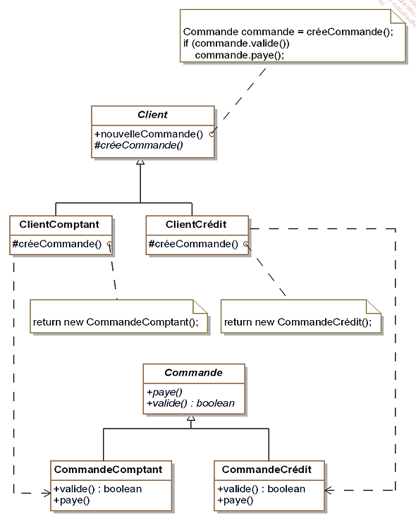

# patternDesignC-

#Initialisation repo

Abstract Factory
Abstract Factory est un pattern qui aide à la création d'objet, le but est de regrouper les objets en famille sans avoir à connaitre les bases de ces objets.

Abstract Factory va permettre de déresponsabiliser la classe mère. Pour cela, nous utilisons une interface qui va contenir des signatures de méthodes.

Architecture de l'application

Ici FabriqueVehicule est une interface qui contient deux signatures de méthodes créeAutomobile() et créeScooter().

La classe Scooter est une classe mère d'héritage, les classes filles ScooterElectricité et ScooterEssence utilisent extends Scooter pour étendre cette classe.

Architecture de l'application

Dans le second schéma, version générique du pattern, les structures sont affichées de façon plus générique FabriqueConcrète1 et FabriqueConcrète2 correspondraient à FabriqueVéhiculeElectricité et FabriqueVehiculeEssence.

ProduitAbstraitA correspond à scooter et ProduitAbstraitB à Automobile.

Pattern Builder
Création d'objets complexes sans avoir à s'occuper des problèmes d'implémentations

Ce pattern est utilisé pour séparer l'implémentation d'un cas spécifique de la logique/ du client.

ConstructeurAbstrait

ConstructeurLiasseVéhiculeHtml et ConstructeurLiasseVehiculePdf correspondent à ConstructeurConcret

Factory method
Généraliser la construction Builder pour préparer la création d'objet

Version générique vue en cours

Version concrète vue en cours

Singleton
